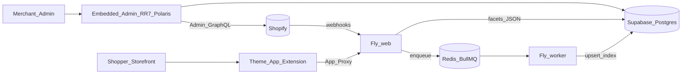

# Findly: Smart Filters & Search — App Flow & Setup

Single reference for **how the app is structured**, **how data flows**, and **what you still need to set up / verify**.

MVP scope: **collection filters + storefront search + Theme App Extension**. Analytics, AI/ML ranking, and advanced search extras are deferred (no stubs). Search is in launch scope but not implemented in code yet.

---

## 1. High-level architecture



Three surfaces:

| Surface | Role |
|---------|------|
| **Embedded admin** | Merchant configures filters, sync, billing, settings |
| **Theme App Extension** | Shopper-facing filter (+ search) widgets on the storefront |
| **Backend sync** | Keeps product/collection/metafield index current via Admin GraphQL + BullMQ |

---

## 2. Repository structure

```
app/
  routes/
    app.tsx                 # Auth shell + Polaris + nav
    app._index.tsx          # Dashboard — collections + config status
    app.collections.$id.tsx # Per-collection filter toggles / order
    app.metafields.tsx      # Map discovered metafields → filters
    app.sync.tsx            # Queue full sync, status
    app.billing.tsx         # Free / Pro plans + usage
    app.settings.tsx        # Widget position, accent, counts
    apps.smart-filter.filters.tsx  # App Proxy JSON API
    webhooks.*.tsx          # Shopify webhooks (ack → queue)
    auth.*                  # Managed OAuth / install
  shopify.server.ts         # shopifyApp + PrismaSessionStorage
  db.server.ts              # Prisma client
  queues.server.ts          # BullMQ sync-queue
  workers/                  # Background job processors
  sync/                     # Bulk + incremental sync (Admin GraphQL)
  billing.server.ts         # Plans + AppSubscriptionCreate
  compliance.server.ts      # GDPR purge / audit log
  proxy.server.ts           # App Proxy HMAC + filter payload
  filters.server.ts         # Facet matching / aggregations
extensions/smart-filter/    # Theme App Extension (Liquid + JS + CSS)
prisma/                     # Schema + migrations (PostgreSQL; Supabase via DATABASE_URL + DIRECT_URL)
docs/                       # Specs + this guide
fly.toml                    # web + worker processes
docker-compose.yml          # Optional Docker Postgres + Redis (`npm run dev` does not need this)
```

---

## 3. Runtime flows

### 3.1 Install & auth

1. Merchant installs app → Shopify managed install / token exchange (template `authenticate.admin`).
2. Offline session stored in Postgres `Session` via `PrismaSessionStorage`.
3. `afterAuth` → `ensureShop` + enqueue `shop.fullSync` on `sync-queue`.

### 3.2 Catalog sync

| Trigger | Job | What happens |
|---------|-----|----------------|
| Install / “Run full sync” | `shop.fullSync` | Admin GraphQL **bulk** product query + collections list |
| `bulk_operations/finish` | `shop.ingestBulk` | Download JSONL → `ProductFacet`, memberships, `DiscoveredMetafield` |
| `products/create|update` | `product.upsert` | Single-product refresh |
| `products/delete` | `product.delete` | Remove from index |
| `collections/*` | `collection.rebuild` | Refresh membership + collection row |
| Uninstall / shop redact | `shop.cleanup` | Hard-delete tenant data |

Web process **only enqueues**; worker process runs jobs (`npm run worker`).

### 3.3 Merchant configures filters

1. **Home** — see collections (configured / not).
2. **Collection screen** — enable price / availability / vendor / type / tags; set display order.
3. **Metafields** — pick from sync-discovered keys; set label + list/range/boolean (plan limits apply).
4. **Settings** — widget position, accent, show counts.
5. **Billing** — Free (limits) or Pro (Shopify subscription confirmation).

### 3.4 Storefront filter widget

1. Merchant enables the **Collection filters** app embed (Theme settings → App embeds). The optional **Collection filters** app block is still available for custom placement.
2. Widget boots on idle (`requestIdleCallback`) — does not block LCP.
3. Fetches `GET /apps/smart-filter/filters?collection_id=…` (App Proxy → your app).
4. App loads `FilterConfig` + mappings + indexed products for that collection → JSON facets.
5. JS shows/hides product cards client-side; state in `#sf=` hash (`replaceState`) — **no crawlable `?filter=` URLs**.

---

## 4. Data model (multi-tenant)

Every business table is shop-scoped (`Shop` FK), except `Session` (keyed by `shop` domain) and `ComplianceRequest` (audit by domain).

| Model | Purpose |
|-------|---------|
| `Session` | OAuth tokens (Shopify session storage) |
| `Shop` | Tenant + plan label |
| `FilterConfig` | Per-collection (or shop-wide `collectionGid=""`) toggles + order |
| `MetafieldMapping` | Merchant-chosen metafield filters |
| `DiscoveredMetafield` | All metafields found during sync (mapping UI) |
| `ProductFacet` | Denormalized product index |
| `Collection` / `CollectionMembership` | Collection list + product links |
| `SyncJob` | Per-shop sync status / errors |
| `Subscription` | Billing mirror + limits |
| `AppSettings` | Widget settings |
| `ComplianceRequest` | GDPR webhook audit log |

---

## 5. Admin routes (Polaris)

| Path | Screen |
|------|--------|
| `/app` | Collections dashboard |
| `/app/collections/:id` | Filter config for one collection |
| `/app/metafields` | Metafield mapping |
| `/app/sync` | Sync controls |
| `/app/billing` | Free / Pro + usage |
| `/app/settings` | Widget settings |

---

## 6. Setup required (tools & accounts)

### 6.1 Tools to install

| Tool | Why |
|------|-----|
| **Node.js** ≥ 20.19 (see `package.json` engines) | App runtime |
| **npm** | Dependencies |
| **Docker Desktop** *(optional)* | Alternative to the bundled local Postgres/Redis |
| **Shopify CLI** (`npm i -g @shopify/cli`) | `shopify app dev` / deploy |
| **Fly CLI** *(when deploying)* | `fly launch` / secrets / deploy |
| **Git** | Version control |

### 6.2 Accounts / assets

| Item | Why |
|------|-----|
| Shopify Partner account | Create the app |
| Development store | Install + test (ideally **50+ products**) |
| App API key + secret | `.env` + `shopify.app.toml` `client_id` |
| Postgres database (Supabase) | Sessions + catalog index. Prisma: pooled `DATABASE_URL` (6543) + `DIRECT_URL` (5432) |
| Redis | BullMQ `sync-queue` |
| Fly.io *(production)* | Host `web` + `worker` |

### 6.3 Environment variables

Copy `.env.example` → `.env` (never commit secrets):

| Variable | Required | Notes |
|----------|----------|--------|
| `SHOPIFY_API_KEY` | Yes | Partner app client ID |
| `SHOPIFY_API_SECRET` | Yes | Partner app secret |
| `SCOPES` | Yes | Default `read_products` |
| `SHOPIFY_APP_URL` | Yes | Local: CLI tunnel. Production: `https://findly.hunaniinfotech.com` |
| `DATABASE_URL` | Yes | Supabase **pooled** URI (port 6543) with `?pgbouncer=true&sslmode=require`. Encode `@` in the password as `%40`. |
| `DIRECT_URL` | Yes | Supabase **direct** URI (port 5432) with `?sslmode=require`. Used by `prisma migrate deploy`. |
| `REDIS_URL` | Yes | Redis for BullMQ (local `redis://localhost:6379` in dev) |
| `BILLING_TEST_MODE` | Recommended | `true` in development |
| `PROXY_SIGNATURE_BYPASS` | Optional | Local only |
| `PORT` | Optional | Default `3000` |

Also set `client_id` in `shopify.app.toml` to the API key.

---

## 7. Local run (after tools are ready)

```powershell
# 1) Fill .env with Shopify credentials, then:
npm install
npm run dev            # Redis (+ unused local Postgres if 5432 is free) + migrate on Supabase + worker + Shopify app

# 2) Install on a development store in the browser
node .\scripts\verify-step1.mjs
node .\scripts\verify-step2.mjs
```

`npm run dev` still starts local Redis (and local Postgres in `.local/` if port 5432 is free). With the current `.env`, Prisma talks to **Supabase**, not that local copy. `prisma migrate deploy` therefore runs against live Supabase. Docker remains optional for a local DB: `docker compose up -d`, then `npm run dev:shopify` and `npm run worker`. Keep the local database until the app is confirmed on Supabase.

---

## 8. Further steps (verification order)

Do **not** treat Theme Extension / billing as “done” until earlier gates pass on a **real** store. Track status in [`build-order.md`](./build-order.md).

| # | Step | How to verify |
|---|------|----------------|
| 1 | Postgres + migrations | `npm run setup` + `verify-step1.mjs` |
| 2 | Auth / session persists | Install via `npm run dev` + `verify-step2.mjs` |
| 3 | Models applied | Tables exist in Postgres |
| 4 | Bulk sync | Install / Run sync; `ProductFacet` count ≥ 50 |
| 5 | Webhook sync | Edit a product in Admin → index updates |
| 6 | Admin collection + filter config | Configure a collection; save OK |
| 7 | Metafield mapping | Map a discovered metafield; save OK |
| 8–9 | Theme extension filters | Add block; filters hide/show products; no crawlable filter URLs |
| 10 | Storefront search | Theme search widget/block; solid basic product search |
| 11 | Billing | Free limits enforce; Pro confirmation URL works |
| 12 | Compliance | Uninstall / redact paths purge or log correctly |
| 13 | Manual QA | Full pass on the same store |

### Production (later)

1. Use the existing Supabase Postgres project (`DATABASE_URL` pooler + `DIRECT_URL` direct) and provision Redis (local for dev; Fly/Upstash/VPS for production).
2. `fly secrets set` for secrets including `DATABASE_URL` and `DIRECT_URL`; set non-secrets in `fly.toml`.
3. Deploy image with processes: `web` + `worker`.
4. `shopify app deploy` for app config + Theme App Extension.
5. Point App URL, OAuth redirect, and App Proxy at `https://findly.hunaniinfotech.com` (CNAME to the Fly app + `fly certs add`).
6. Set `BILLING_TEST_MODE=false` for real charges when ready.

---

## 9. v1 non-goals (do not build)

- Filter/search analytics dashboard — deferred / no stubs  
- AI/ML relevance ranking — deferred / no stubs  
- Synonym groups, typo-tolerance engines, redirects/boosts beyond solid basic search — deferred / no stubs  
- Drag-drop / custom theme editor beyond basic position (+ accent / counts)

---

## 10. Related docs

| File | Contents |
|------|----------|
| [`build-order.md`](./build-order.md) | Live verification checklist / blockers |
| [`build-instructions.md`](./build-instructions.md) | Full MVP build spec |
| [`mvp-guide.md`](./mvp-guide.md) | Product/scope notes |
| [`../README.md`](../README.md) | Short quick start |
