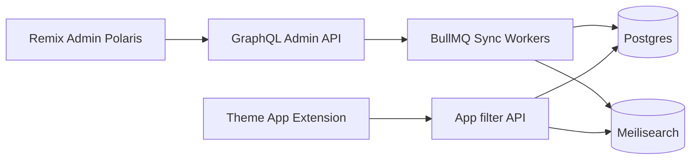

# Findly competitive comparison — gap review

Source reviewed: [COMPETITIVE-COMPARISON.md](c:\Users\pc\Downloads\COMPETITIVE-COMPARISON.md) vs [Globo — Smart Product Filter & Search](https://apps.shopify.com/product-filter-and-search).

**Verdict:** The doc’s positioning (filters-first, search/AI deferred) is correct and smart for approval speed. It is **not** missing the big Globo suite (search/AI) by accident — those are intentional non-goals. What *is* missing are several **filter table-stakes**, **merchant UX**, and **App Store / ops** items that should appear in the matrix and preferably land in Findly v1.

---

## What the colleague doc already gets right

- Clear v1 vs v2 split (filters now; search/analytics later)
- Honest marketing angle vs Globo
- Core facets covered: price, availability, vendor, type, tags, metafields
- Per-collection config, Theme App Extension, Billing, GDPR, sync — good platform baseline
- Correct non-goals: AI search, YMM, variants-as-products, recommendations, deep theme editor

Do **not** expand v1 into a Globo clone. Fill the gaps below instead.

---

## Missing or under-specified vs Globo (filter product)

These appear on Globo’s listing / feature lists but are absent or only implied in Findly’s matrix:

| Gap | Why it matters | Suggested Findly status |
|---|---|---|
| **Variant option filters as first-class** (size, color, material) | Globo reviews stress color/size; doc marks this **Partial** — too weak for a filter app | Promote to **Yes (v1)** |
| **Filter display types** (checkbox, swatch, dropdown, range slider, boolean) | Merchants expect color swatches + price slider | Add row; **Yes/Partial v1** |
| **Applied filter chips + Clear all** | Standard collection UX; not listed | **Yes (v1)** |
| **Sorting with filters** (price, title, newest, best selling if available) | Globo lists Sorting under display customization | **Yes (v1)** or early v1.1 |
| **Sale / discount % filter** | Explicitly marketed by Globo (“sale %”) | **Yes (v1)** or **v1.1** |
| **Brand vs vendor** | Globo lists both; often brand = vendor or metafield | Clarify in matrix |
| **Collection facet** (filter by collection on catalog / multi-collection views) | Globo markets collection filters | Decide: v1 or out of scope |
| **Review rating filter** | Globo + Judge.me “Works with” | **No (v2)** + note integration |
| **Menu styles: dropdown / tree / mobile drawer** | Globo: Mobile menu, Dropdown, Tree, Sidebar | Doc only has left/right/top — add **mobile drawer** at least for v1 |
| **AND/OR multi-filter behavior** | Globo “Multi-filter”; merchants need predictable logic | Document + implement (typical: OR within facet, AND across facets) |
| **Empty results state** | Required for polish / review | **Yes (v1)** |
| **Hide OOS vs show OOS toggle** | Beyond simple availability facet | **Yes (v1)** settings |
| **Real-time sync SLA** | Globo markets “Real-time sync”; Findly has webhooks — make explicit | Add ops row: webhook + queue lag expectations |
| **Markets / multi-currency prices** | Globo “Works with Markets, international pricing” | **Partial/v2** — at least document limitation |
| **Conflict with native Search & Discovery filters** | Common merchant pain; not mentioned | Add “compatibility / disable native filters” guidance |
| **Stop words, boosts, redirects, personalized search, recommendations** | Globo search suite | Keep **No / No (v2)** — already correct |

---

## Missing for Shopify App Store approval (not in the comparison)

The comparison is product-focused. For “easily approve,” add an **App Store readiness** section (or a sibling checklist):

- Embedded admin + latest App Bridge + session tokens (no third-party cookie auth)
- GraphQL Admin API only (no new REST)
- Theme App Extension only (no script-tag injection) — already Yes; keep it
- Clean uninstall (extension + metafields/app data cleanup)
- Billing: upgrade/downgrade without reinstall; trial behavior correct
- Mandatory webhooks: `customers/data_request`, `customers/redact`, `shop/redact` + app/uninstalled
- Privacy policy URL, support contact, listing screenshots + demo screencast + test store credentials
- Onboarding that reaches first value in &lt; ~5 minutes (enable collection → see filters)
- Storefront performance: async widget, scoped CSS, avoid Lighthouse regressions (BFS later cares about this)
- Protected customer data justification if requesting customer scopes (prefer minimal scopes)
- Listing honesty: do not claim AI/search until v2

Related docs referenced in the comparison (`APP-FLOW-AND-SETUP.md`, `build-order.md`, `mvp-guide.md`) were **not in Downloads** next to this file — only `COMPETITIVE-COMPARISON.md` was present. Those should live in the repo so the matrix is not orphaned.

---

## Recommended v1 additions (priority)

**Must add to v1 (or the comparison understates the product):**

1. First-class **variant option** filters (size/color/etc.) — not “Partial”
2. **Swatches** for color-like options + **range slider** for price
3. **Applied chips + Clear all**
4. **Mobile filter drawer**
5. Documented **facet logic** (OR within / AND across)
6. **Empty state** + loading/error states on storefront
7. **Sorting** alongside filtered results
8. App Store **compliance & listing** checklist (above)

**Should add soon (v1.1), still filter-scoped:**

- Sale % / “On sale” filter
- Per-filter label rename + show/hide count (partially implied)
- Basic font/color beyond accent (still not full custom CSS)
- Development-store free unlock (Globo-style) for partners — helps installs/reviews

**Keep deferred (colleague was right):**

- AI/semantic search, autocomplete, synonyms, redirects, recommendations, analytics dashboards, YMM, variants-as-products, unlimited visual filter-tree builder, Judge.me deep integration

---

## Suggested edits to COMPETITIVE-COMPARISON.md

1. Section **A**: add rows for display types, chips/clear, sort, sale filter, brand clarification, mobile drawer, facet logic, empty state, Markets/currency limitation, native S&D coexistence.
2. Promote **variant options** from Partial → Yes (v1) if that is the build intent; if not, call it a launch risk.
3. New section **E. App Store / BFS readiness** (compliance, listing, performance, uninstall).
4. New section **F. Known limitations** (no search, no analytics, currency/Markets, no review ratings).
5. Align “v1 checklist” checkboxes with the new must-haves so marketing and engineering share one promise.
6. Link or copy sibling docs into the Findly repo when scaffolding starts.

---

## Architecture note (unchanged recommendation)

For the filters-only v1 described in the doc, stick with:

- **Shopify CLI + Remix (React Router) template**
- **PostgreSQL** (sessions, shop config, filter mappings, plan caps)
- **Meilisearch or Typesense** (faceted collection queries) — or Postgres facets only if catalogs stay small; Meilisearch preferred before 5k products on Pro
- **BullMQ + Redis** (already implied by `sync-queue`)
- **Theme App Extension** for storefront widget
- Host: **Railway or Fly.io** (Remix + Postgres + Redis + Meilisearch)

XAMPP is fine for local notes only — not for the live app URL Shopify reviews.

---

## Bottom line

Colleague plan is **directionally right**. Biggest holes: treat **variant/color filters + swatches + chips + sort + mobile drawer** as v1 must-haves, and add an **App Store readiness** section the comparison currently lacks. Do not pull AI search into v1 to “match Globo.”
